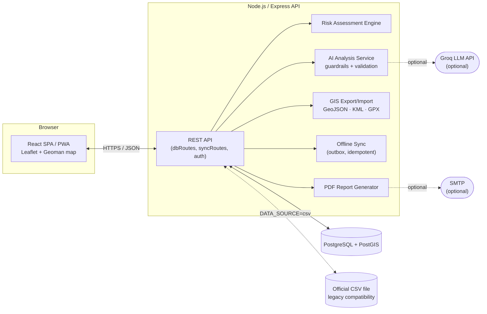
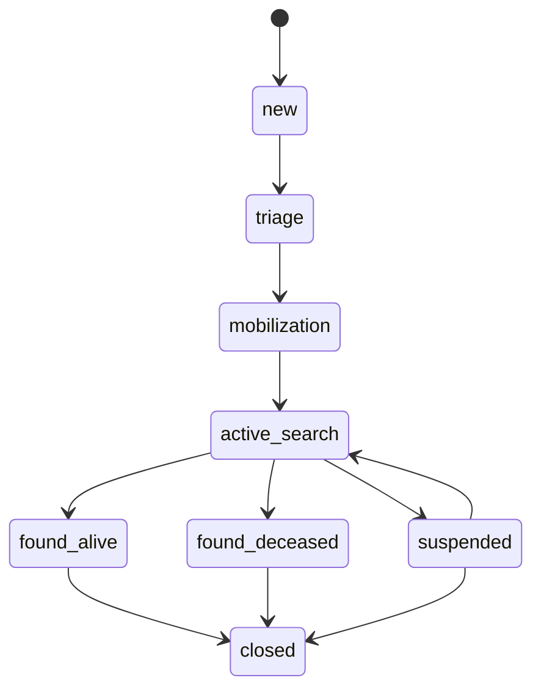

# SAR Missing Persons Management System

An operational web platform to register, triage, plan and track Search and Rescue (SAR) cases for missing persons — built for, and by a member of, the Portuguese National Republican Guard (GNR).

> **Status:** personal / academic project, actively evolving. Originally a small internal tool, it has grown into a full operational platform (PostgreSQL/PostGIS backend, mapping, audit timeline, offline sync, AI-assisted analysis) while remaining compatible with the original official paper/CSV workflow.

---

## About this project

I'm Rui Casaca. I served at the GNR (Guarda Nacional Republicana — the Portuguese National Republican Guard), in the UEPS (*Unidade de Emergência de Proteção e Socorro* — Emergency Protection and Rescue Unit), and I'm also a Computer Engineering student. This project sits at the intersection of both worlds.

When a person goes missing, the first minutes and hours matter. In practice, the intake and triage of a missing-person report at unit level still relies heavily on a paper form and spreadsheets, with no structured way to keep a timeline of what happened, plan search areas on a map, assign tasks to teams, or quickly cross-reference a new case against historical ones. There was no dedicated internal tool for this, and building one wasn't part of anyone's job — so I built it on my own initiative, in my own time, to close a gap I saw first-hand in the service.

It started as a small script to help fill in a form and calculate a risk level. It grew into this: a real operational web application, and along the way, the subject of my own learning as a software engineering student — which is also why this README is written the way a student documenting their own project would write it: explaining not just *what* the system does, but *why* it's built the way it is.

**A note on data and confidentiality.** This is a real project used in a real operational context, so before publishing it I had to remove everything that shouldn't be public:

- All sample case data in this repository (`historico_casos*.csv`) is **fictional**, written specifically for this public version. No real missing-person case data is included or was ever meant to be shared this way.
- All real credentials, personal emails and infrastructure hostnames have been replaced with placeholders (see [`.env.example`](.env.example)).
- The exact scoring rubric behind the risk-assessment engine (which indicators, what weight, what thresholds) draws on internal GNR operational guidance that isn't mine to publish. The public code ships a **generic, illustrative example** of that engine (see [Risk assessment engine](#risk-assessment-engine)) so the project still runs end-to-end; the real configuration is kept in a private, git-ignored file.

If you're evaluating this repository as a recruiter or engineer, everything you can run and click through is real code and a real architecture — only the specific domain values behind the risk model and the underlying case data are intentionally not the real ones.

---

## Table of contents

- [About this project](#about-this-project)
- [Features](#features)
- [Architecture](#architecture)
  - [Dual data source: CSV and PostGIS](#dual-data-source-csv-and-postgis)
  - [Case workflow](#case-workflow)
  - [Risk assessment engine](#risk-assessment-engine)
  - [AI-assisted analysis, with guardrails](#ai-assisted-analysis-with-guardrails)
  - [Offline-first sync](#offline-first-sync)
- [Tech stack](#tech-stack)
- [Project structure](#project-structure)
- [Getting started](#getting-started)
  - [Requirements](#requirements)
  - [Quick start](#quick-start)
  - [Demo login](#demo-login)
- [Testing and quality](#testing-and-quality)
- [API overview](#api-overview)
- [Known limitations and roadmap](#known-limitations-and-roadmap)
- [License](#license)

---

## Features

- **Official form + fast intake.** Full digital version of the official document missing-person form, plus a "quick registration" path so a case can be opened in `triage` in under a minute when time matters more than completeness.
- **Case workflow with audit trail.** Every case moves through an explicit state machine (`new → triage → mobilization → active_search → suspended → found_alive / found_deceased → closed`), and every transition, clue, task, area or track is recorded as an immutable event in a `case_events` timeline.
- **Operational map.** Search areas (circles or free-hand polygons), search tracks (GPS-like line strings) and clues are drawn directly on a Leaflet map (via Leaflet-Geoman) and persisted as real PostGIS geometry.
- **Risk assessment engine.** Automatic risk classification (`Normal / Moderado / Elevado`) and search priority (`Rotina / Urgente / Muito Urgente`) from the case's own data, driven by a configurable indicator/weight model (see below).
- **AI-assisted analysis (optional).** An LLM (via Groq) can generate a structured, evidence-cited analysis (priorities, immediate actions, hypotheses) from the case and its historical context — validated against an anti-hallucination guardrail before being shown to a user.
- **Teams and tasks.** Lightweight team management and task assignment/tracking tied to each case.
- **GIS interoperability.** Export a case's operational picture (areas, tracks, clues) as GeoJSON, KML or GPX; import GeoJSON polygons back in as search areas.
- **Offline-first quick registration.** A basic offline outbox lets a quick case registration be created without connectivity and synced later, idempotently, once the device is back online.
- **CSV compatibility.** The system can still read and write the exact official CSV format used before this platform existed, so it can sit alongside (or gradually replace) the previous paper/spreadsheet-based process.
- **PWA shell + PDF reporting.** Installable app shell with a service worker, and automatic generation/emailing of a PDF case report.

---

## Architecture



The system is a fairly classic three-tier web app (React SPA talking to an Express REST API backed by PostgreSQL), but two decisions shape most of the rest of the design:

1. It had to keep working with the **existing official CSV form** the unit already used, rather than force a disruptive one-shot migration.
2. Every meaningful operational action had to be **auditable** — who did what, when, and why — because these are real search-and-rescue decisions.

### Dual data source: CSV and PostGIS

The project started as a CSV-only tool. Rewriting it around PostgreSQL/PostGIS was a deliberate incremental migration, not a rewrite-and-hope-for-the-best:

- `DATA_SOURCE=csv|db` controls whether the official endpoints read from the flat CSV file or from the operational database.
- `DB_DUAL_WRITE=true` writes to **both** the CSV and PostGIS at the same time, so the system can run in a transitional mode without losing the CSV as a source of truth or compatibility layer.
- The full original CSV payload is preserved verbatim in `cases.official_payload` (a JSONB column), so the exact official form can always be reconstructed and re-exported byte-for-byte, even though the operational data now also lives in properly typed, queryable, geo-indexed tables.

This is implemented in [`backend/db/caseMapper.js`](backend/db/caseMapper.js) (CSV ⇄ operational-case mapping) and orchestrated through [`backend/db/caseRepository.js`](backend/db/caseRepository.js), [`backend/dbRoutes.js`](backend/dbRoutes.js) and the import/export scripts in [`backend/scripts/`](backend/scripts/).

### Case workflow



Every transition requires a justification and is recorded as a `case_status_changed` event, alongside every clue, task, search area and track creation/edit — all captured in [`backend/db/caseEventRepository.js`](backend/db/caseEventRepository.js) and rendered as a timeline in [`frontend/src/CaseDetail.js`](frontend/src/CaseDetail.js).

### Risk assessment engine

[`backend/riskAssessment.js`](backend/riskAssessment.js) is a small generic rules engine: it evaluates a fixed set of boolean conditions over the case's own fields (age, reported circumstances, medical context, etc.), and for every condition that's true, adds a weighted "indicator" to the case. The accumulated score (plus a couple of always-critical indicators) determines the risk level and search priority.

**What's public vs. private here, and why:** the engine itself (`riskAssessment.js`) is fully open — conditions, scoring logic, everything. What is *not* published is the exact indicator list, weights, thresholds and operational recommendation text, because that specific rubric reflects internal GNR operational guidance, not something of my own that I can freely publish. The engine loads that configuration from `backend/config/riskManual.js`, which is **git-ignored** — locally, it holds the real methodology; if it's absent (as it will be on a fresh clone of this repository), the engine transparently falls back to [`backend/config/riskManual.example.js`](backend/config/riskManual.example.js), a clearly-labelled, generic placeholder rubric with different numbers, so the whole pipeline (indicators → score → risk level → priority → recommendations) still runs and can be inspected end-to-end. This mirrors the same pattern used for secrets: a real, private file plus a committed `.example` counterpart.

### AI-assisted analysis, with guardrails

An optional LLM step (Groq, currently `openai/gpt-oss-120b` as a reasoning model) can turn a case plus its historical context into a structured analysis: priorities, immediate actions, hypotheses, missing information and safety warnings. This is deliberately built to be *assistive, not authoritative*:

- [`backend/ai/promptPacketBuilder.js`](backend/ai/promptPacketBuilder.js) builds an explicit **evidence register** from the case data — every fact the model is allowed to use gets an `evidence_id` — instead of just dumping free text into a prompt.
- The system prompt forces the model to cite `evidence_ids` for every claim, forbids inventing coordinates/witnesses/suspects/medical facts, and requires every output item to be flagged `human_review_required: true` and `not_decision: true`.
- [`backend/ai/analysisValidator.js`](backend/ai/analysisValidator.js) then re-checks the model's JSON response against that same evidence register after the fact — rejecting unsupported coordinates, and flagging sensitive unsupported claims (e.g. a claimed witness sighting, a suicide risk claim, or a vital-status claim not actually backed by the evidence) — before anything reaches a user.
- If `GROQ_API_KEY` isn't set, this feature fails closed and predictably rather than breaking the rest of the app.

### Offline-first sync

Quick case registration works offline: operations are queued in a local outbox ([`frontend/src/offlineStore.js`](frontend/src/offlineStore.js)) and replayed against `POST /api/sync/push` once connectivity returns. Each operation carries a `client_operation_id`, so replaying the same operation twice (e.g. after a flaky connection) is a no-op rather than a duplicate — handled in [`backend/syncRoutes.js`](backend/syncRoutes.js).

---

## Tech stack

| Layer | Technology | Notes |
|---|---|---|
| Frontend | React 18 (Create React App), TypeScript (incremental, `allowJs`) | SPA + installable PWA (service worker, manifest) |
| Mapping | Leaflet, `@geoman-io/leaflet-geoman-free` | Drawing/editing of areas, tracks, points |
| Backend | Node.js, Express | REST API, incremental TypeScript migration |
| Database | PostgreSQL + PostGIS | Operational store, geometry, spatial queries |
| Validation | Zod | Runtime validation on write endpoints and sync payloads |
| Auth | JWT + bcrypt | Local user store (`users.json`) for now, see [Known limitations](#known-limitations-and-roadmap) |
| AI / LLM | Groq SDK (`openai/gpt-oss-120b`) | Optional, guarded, evidence-cited analysis |
| Documents | PDFKit, Nodemailer | Case report generation and delivery by email |
| GIS interoperability | `fast-xml-parser` (KML/GPX), GeoJSON | Export/import of operational geometry |
| Testing | Node's built-in `node:test` + `tsx` | 66 backend unit/integration tests |
| Infrastructure | Docker, Docker Compose, PostGIS image, Adminer | One-command local environment |
| Deployment (frontend option) | Cloudflare Workers (`wrangler`) | Static asset hosting alternative |

---

## Project structure

```text
.
├── backend/
│   ├── server.js                 # Express app entry point, health check, wiring
│   ├── auth.js                   # Login, JWT issuance, auth middleware
│   ├── dbRoutes.js               # Operational REST API (cases, clues, tasks, areas, tracks, GIS)
│   ├── syncRoutes.js             # Offline sync endpoints (push/pull/status)
│   ├── registoCasosOficial.js    # Official PDGNR form: CSV read/write, geocoding, weather lookup
│   ├── riskAssessment.js         # Generic risk-scoring engine (see Architecture)
│   ├── promptBuilder.js / promptBuilderOficial.js
│   ├── ai/                       # LLM prompt packet builder, JSON schema, response validator/guardrails
│   ├── config/
│   │   ├── riskManual.example.js #  ← public, illustrative risk methodology
│   │   └── riskManual.js         #  ← private, git-ignored, real methodology (not in repo)
│   ├── db/
│   │   ├── init/                 # DB extensions (postgis, pgcrypto)
│   │   ├── migrations/           # Operational schema migrations
│   │   ├── caseMapper.js         # CSV ⇄ operational-case mapping
│   │   ├── caseRepository.js     # Cases, workflow, quick registration
│   │   ├── caseEventRepository.js# Audit timeline
│   │   ├── clueRepository.js / taskRepository.js / teamRepository.js
│   │   ├── searchAreaRepository.js / trackRepository.js
│   │   └── migrate.js            # Migration runner
│   ├── scripts/                  # CSV import/export, event backfill, demo admin seed
│   ├── validation/                # Zod schemas (request payloads)
│   ├── types/domain.ts           # Shared TypeScript domain types
│   ├── test/                     # 66 backend tests (node:test)
│   └── users.json                # Local auth store — git-ignored, never committed
├── frontend/
│   └── src/
│       ├── App.js                # Shell, routing, layout
│       ├── Dashboard.js          # Case list/overview
│       ├── CaseRegistrationOfficial.js / CaseRegistration.js / QuickCaseRegistration.js
│       ├── CaseDetail.js         # Map, timeline, clues, tasks, areas, tracks
│       ├── FoundModal.js / UserManagement.js / Login.js
│       ├── PromptView.js         # AI analysis view
│       ├── offlineStore.js       # Offline outbox
│       └── api.js                # Backend API client
├── historico_casos_pdgnr_oficial.csv   # Official-format sample data (fictional, see disclaimer)
├── historico_casos.csv                 # Legacy-format sample data (fictional, see disclaimer)
├── docker-compose.yml            # PostGIS + backend + Adminer
├── .env.example                  # All configuration, placeholder values only
├── STARTOF.md                    # Full step-by-step setup guide (Portuguese)
└── MIGRACAO_PDGNR_OFICIAL.md     # Detailed notes on the CSV → PostGIS migration (Portuguese)
```

`STARTOF.md` and `MIGRACAO_PDGNR_OFICIAL.md` go deeper into day-to-day operational setup and the CSV/DB migration respectively, written in Portuguese since that's the language of the people who would actually operate this system.

---

## Getting started

### Requirements

- Node.js (LTS) and npm
- Docker Desktop (for PostgreSQL/PostGIS via Docker Compose)
- (Optional) a [Groq](https://groq.com/) API key, only needed for the AI-assisted analysis feature

### Quick start

```bash
# 1. Configure environment
cp .env.example .env

# 2. Start PostgreSQL/PostGIS
docker compose up -d

# 3. Backend: install, migrate, load sample data
cd backend
npm install
npm run db:migrate
npm run db:import-csv
npm start

# 4. Frontend (in another terminal)
cd frontend
npm install
npm start
```

The backend also serves the built frontend directly at `http://localhost:4000/app` once `npm run build` has been run in `frontend/`. See [STARTOF.md](STARTOF.md) for the complete guide, including Windows/PowerShell-specific commands, troubleshooting and maintenance commands.

### Demo login

Since `users.json` is never committed (it holds bcrypt password hashes), a fresh clone has no users. To create a disposable demo admin account for local evaluation:

```bash
cd backend
npm run seed:demo-admin
```

This creates (or resets) a **local-only, demo-only** account:

```text
username: demo
password: Demo@12345
```

This is meant purely so a reviewer can log in and click through the app — it is not, and should never be, used outside a local evaluation environment.

---

## Testing and quality

```bash
cd backend
npm run typecheck   # TypeScript check (incremental, allowJs)
npm test            # 66 tests via node:test — repositories, mappers, validation, risk engine, GIS export/import, sync
```

```bash
cd frontend
npm run typecheck
npm run build
```

---

## API overview

| Endpoint | Purpose |
|---|---|
| `GET /api/health` | API, DB, PostGIS, pgcrypto, CSV and frontend-build status |
| `GET /api/db/casos-oficial` | List operational cases |
| `POST /api/db/quick-cases` | Fast SAR intake (creates a case in `triage`) |
| `PATCH /api/db/casos-oficial/:id/status` | Workflow transition (requires justification) |
| `GET /api/db/casos-oficial/:id/timeline` | Audit timeline for a case |
| `GET/POST /api/db/casos-oficial/:id/clues` | Clues |
| `GET/POST /api/db/casos-oficial/:id/tasks` | Tasks |
| `GET/POST /api/db/casos-oficial/:id/search-areas` | Search areas (circular or drawn) |
| `GET/POST /api/db/casos-oficial/:id/tracks` | Search tracks |
| `GET /api/db/casos-oficial/:id/gis/export?format=geojson\|kml\|gpx` | GIS export |
| `POST /api/db/casos-oficial/:id/gis/import` | GeoJSON import |
| `POST /api/sync/push` / `GET /api/sync/pull` | Offline sync |

---

## Known limitations and roadmap

This is a real but still-evolving project. Being upfront about its current gaps:

- **Auth is local-file based** (`users.json` + bcrypt + JWT). It works for demonstration and small deployments, but should move to a proper `app_users` table with role-based access control before any real pilot.
- **Offline sync only covers quick registration** today; clues, tasks, areas and tracks still need their offline path built out.
- **GIS import currently only accepts GeoJSON** polygons for search areas (export already supports GeoJSON/KML/GPX).
- **Tracks are stored as one `LineString` per submission**, not as a continuous, point-by-point live feed from a team in the field.
- Fine-grained, per-endpoint permissions (beyond `admin`/`user`) are designed but not yet implemented (see [`backend/README-auth.md`](backend/README-auth.md)).

---

## License

No formal license has been chosen for this repository yet. Until one is added, please treat this as **all rights reserved** — feel free to read the code and learn from it, but reach out first if you'd like to reuse or build on it.

---

Built by **Rui Casaca**, and Computer Engineering student.
